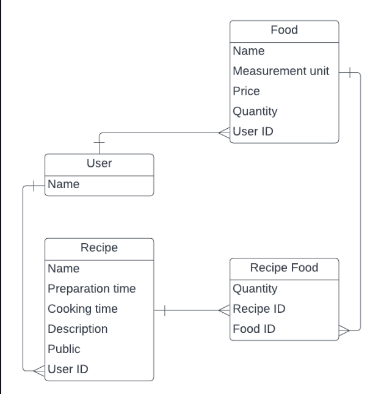

<a name="readme-top" align="center"></a>

<div align="center">
  <h1>Recipe App</h1>
  <br/>

</div>

<!-- TABLE OF CONTENTS -->

# 📗 Table of Contents

- [📖 About the Project](#about-project)
  - [🛠 Built With](#built-with)
    - [Tech Stack](#tech-stack)
    - [Key Features](#key-features)
  - [🚀 Live Demo](#live-demo)
- [💻 Getting Started](#getting-started)
  - [Setup](#setup)
  - [Prerequisites](#prerequisites)
  - [Install](#install)
  - [Usage](#usage)
  - [Run tests](#run-tests)
  <!-- - [Deployment](#triangular_flag_on_post-deployment) --> 
- [👥 Authors](#authors)
<!-- - [🔭 Future Features](#future-features) -->
- [🤝 Contributing](#contributing)
- [⭐️ Show your support](#support)
- [🙏 Acknowledgements](#acknowledgements)
- [📝 License](#license)

<!-- PROJECT DESCRIPTION -->

# 📖 Recipe App <a name="about-project"></a>
The Recipe app keeps track of all your recipes, ingredients, and inventory. It will allow you to save ingredients, keep track of what you have, create recipes, and generate a shopping list based on what you have and what you are missing from a recipe. Also, since sharing recipes is an important part of cooking the app should allow you to make them public so anyone can access them.

## 🛠 Built With <a name="built-with"></a>

### Tech Stack <a name="tech-stack"></a>

<details>
  <summary>Server</summary>
  <ul>
    <li><a href="https://www.ruby-lang.org/en/">Ruby</a></li>
  </ul>
</details>

<details>
  <summary>Database</summary>
  <ul>
    <li><a href="https://www.postgresql.org/">PostgreSQL</a></li>
  </ul>
</details>

<!-- Features -->

### Key Features <a name="key-features"></a>
- A login page.
- A registration page.
- A food list (with all CRUD implementation, except for 'update').
- A recipes list (with all CRUD implementation, except for 'update').
- A general shopping list view (all missing food for all your recipes and total price).
- A list of all public recipes from other users with their names and total prices.

<p align="right">(<a href="#readme-top">back to top</a>)</p>

<!-- LIVE DEMO -->
## 🚀 Live Demo <a name="live-demo"></a>
Not Deployed Yet.


### UML Diagram
 <div align="center">
  
 </div>


<p align="right">(<a href="#readme-top">back to top</a>)</p>

<!-- GETTING STARTED -->

## 💻 Getting Started <a name="getting-started"></a>

To get a local copy up and running, follow these steps.

### Prerequisites
In order to run this project you need:

- To install ruby on your PC. You can read [this](https://rubyinstaller.org/downloads/) documentation on how to do so
- To install postgresql on your PC. You can read [this](https://www.postgresql.org/) documentation on how to do so
- Know how to navigate directories or folders at the CLI.
- Know how to get the URL(https/ssh) of a repository on GitHub.
- You should have a code editor installed, preferably VSCode
- In order to run this project you need:

### Setup
In desired folder or directory in the CLI, run the command:

```sh
git clone git@github.com:elarhadu/Recipe-App.git
```

Navigate into the cloned folder or repository by running the command:
```sh
cd Recipe-App
```

If VsCode is your default code editor, run:
```sh
code .
```

You are all set up!
### Install

Install this project with:

```sh
 bundle install
``` 
### Usage

To setup the database, run
```sh
rails db:drop db:create db:migrate
```

To run the project, execute the following command:

```sh
ruby bin/rails server
```

### Run tests

To run tests, run the following command:

```sh
  rspec spec spec/[filename.rb]
```

<!-- ### Deployment

You can deploy this project using:

```sh

```  -->

<p align="right">(<a href="#readme-top">back to top</a>)</p>

<!-- AUTHORS -->

## 👥 Authors <a name="authors"></a>
👤 **Houda Mzari**

- GitHub: [@houdamzari](https://github.com/houdamzari/)
- LinkedIn: [Houda Mzari](https://www.linkedin.com/in/houda-mzari-2304401b1/)

👤 **Emmanuella Adu**

- GitHub: [@elarhadu](https://github.com/elarhadu)
- Twitter: [@elarh\_](https://twitter.com/elarh_)
- LinkedIn: [Emmanuella Adu](https://linkedin.com/in/emmanuella-adu)


<p align="right">(<a href="#readme-top">back to top</a>)</p>

<!-- FUTURE FEATURES -->

## 🔭 Future Features <a name="future-features"></a>
- This recipe app will provide detailed nutritional information for each recipe, helping users make more informed decisions about their diet.
- This recipe app will enable users to share and collaborate on recipes, allowing for a community-driven approach to recipe creation and discovery.
- This recipe app will use data about users' dietary preferences, health conditions, and past recipe choices to suggest personalized recipe recommendations.

<p align="right">(<a href="#readme-top">back to top</a>)</p>

<!-- CONTRIBUTING -->

## 🤝 Contributing <a name="contributing"></a>

Contributions, issues, and feature requests are welcome!

Feel free to check the [issues page](https://github.com/elarhadu/Recipe-App/issues).

<p align="right">(<a href="#readme-top">back to top</a>)</p>

<!-- SUPPORT -->

## ⭐️ Show your support <a name="support"></a>

If you like this project give us a ⭐

<p align="right">(<a href="#readme-top">back to top</a>)</p>

<!-- ACKNOWLEDGEMENTS -->

## 🙏 Acknowledgments <a name="acknowledgements"></a>

We would like to thank [Microverse](https://github.com/microverseinc) for this project inspiration.

<p align="right">(<a href="#readme-top">back to top</a>)</p>

<!-- LICENSE -->

## 📝 License <a name="license"></a>

This project is [MIT](./LICENSE) licensed.


<p align="right">(<a href="#readme-top">back to top</a>)</p>
